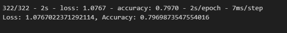

# Data-assignment-week21-deep-learning-challenge

## Overview of the analysis:

The nonprofit foundation Alphabet Soup is seeking a tool for screening applicants for funding with the best chance of success in their ventures. A dataset containing 34,000 organisations that could have received funding was analysed using a binary classifier that can predict whether applicants will be successful if funded by Alphabet Soup.

## Results: 
### Data Preprocessing

+ What variable(s) are the target(s) for your model?

    The target variable for the model is the binary 'IS_SUCCESSFUL' parameter, which indicates if an application was successful or not.

+ What variable(s) are the features for your model?

    The features variables re all the columns in application_df_cleaned dataframe except the target variable outlined above.

+ What variable(s) should be removed from the input data because they are neither targets nor features?

    The variables which were removed were the non-beneficial ID columns, 'EIN' and 'NAME'.

### Compiling, Training, and Evaluating the Model

+ How many neurons, layers, and activation functions did you select for your neural network model, and why?

    After trial and error, I selected the following in the final and most successful model,'AlphabetSoupCharity_Optimisation_V3':

    *First Hidden Layer*: 100 neurons, ReLU activation, kernel regularisation, and a dropout rate of 0.3.

    *Second Hidden Layer*: 60 neurons, ReLU activation, kernel regularisation, and a dropout rate of 0.3.

    *Third Hidden Layer*: 30 neurons, ReLU activation, kernel regularisation, and a dropout rate of 0.3.

    *Output Layer*: 1 neuron and Sigmoid activation.

    I decided to increase the neurons and add a third hidden layer after the first code (AlphabetSoupCharity) code returned an accuracy score of less than the desired 75%. I researched with the assistance of my tutor Noah and OpenAI (2024) to also include kernel reguliser function and dropout rate to further improve the accuracy of the model as both AlphabetSoupCharity_Optimisation and AlphabetSoupCharity_Optimisation_V2 were still below the 75% threshold.

+ Were you able to achieve the target model performance?

    In the third optimisation model AlphabetSoupCharity_Optimisation_V3, I was able to successfully achieve target performance, with an accuracy score of 79.70% (rounded), which was above the accuracy target of 75%.

    *Snippet of V3 code performance output*:
    

+ What steps did you take in your attempts to increase model performance?
    I performed the following to improve my model and ultimately achieve a target accuracy performance of 79.90%.

    1. Increased the number of neurons
    2. Increased the number of hidden layers
    3. Utilised kernal regularisation functionality
    4. Utilised dropout rate functionality

    After trial and error, I was finally successful after the third version of code optimisation in achieving an accuracy performance score above 75%.

## Summary: 
The deep learning challenge neural network model developed on behalf of Alphabet Soup Charity to examine applicants for funding successfully achieved the target model performance. The model is therefore worthwhile to implement in practical applications for Alphabet Soup. 

While the neural network model achieved the target accuracy performance, a Logistic Regression model could also be a explored for Alphabet Soup. This is another binary classification model and is simplistic and quicker to run than the neural network model utilised.

## Reference List
Data-assignment-week21-deep-learning-challenge, Tutor Session with Noah, personal communication (Zoom), May 19, 2024

OpenAI. (2024). ChatGPT (May 22 version) [Large language model]. Retrieved May 22, 2024 from https://chat.openai.com/

University of Adelaide. (2024). Electricity Forecast. GitLab. Retrieved May 19, 2024, from https://git.bootcampcontent.com/University-of-Adelaide/UADEL-VIRT-DATA-PT-12-2023-U-LOLC/-/blob/main/21-Neural-Networks-Deep-Learning/3/Activities/04-Evr_SageMaker_Deployment/Solved/electricity_forecast.ipynb?ref_type=heads

